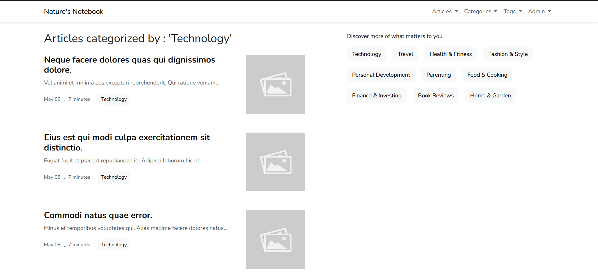
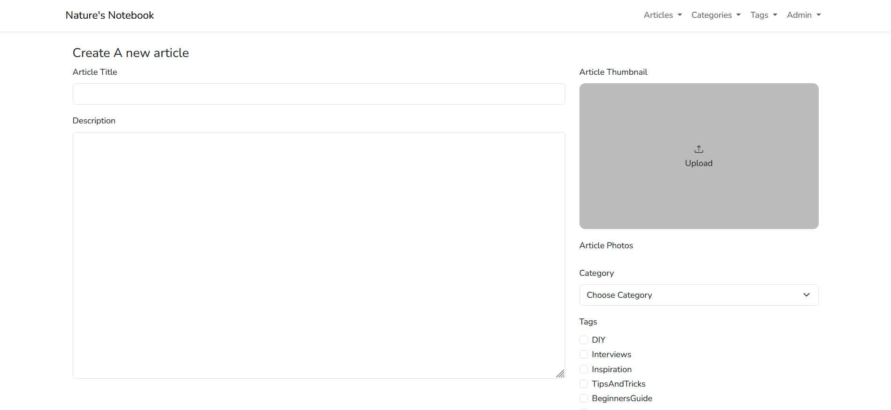
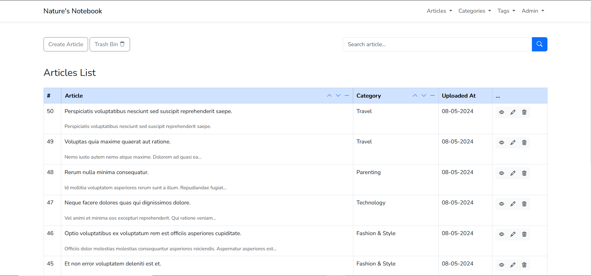

# Personal Blog Laravel Practice Project 📝

Welcome to my Personal Blog practice project! This is a hands-on endeavor to enhance my Laravel development skills and build a fully functional personal blog from scratch.

## Project Overview:
- Personal Blog: The project simulates a personal blog where I can publish articles on various topics of interest.
- Single Admin Access: Only one user, 'admin', has the privilege to perform CRUD operations on tags, categories, and articles. This ensures the security and integrity of the blog's content.
- Guest Access: Visitors and guests can browse and read the published articles without the need for registration. Their experience focuses solely on content consumption.
- Tags and Categories: I have implemented the organization of articles using tags and categories, making it easier for readers to find specific topics they are interested in.
- Laravel Learning: The primary purpose of this project is to deepen my understanding of Laravel's features, including routing, middleware, controllers, and database interactions.

## Installation and Usage

To try and test the application, run the following commands:
```bash
npm install
composer install
php artisan migrate
php artisan db:seed
php artisan storage:link
```

## Key Features:
✅ Single Admin Account
✅ Guest Access for Reading
✅ CRUD Operations for Admin
✅ Tags and Categories for Organizing Content
✅ Laravel Best Practices Applied

## App sample images








Feel free to explore the code.
Happy coding! 🚀
